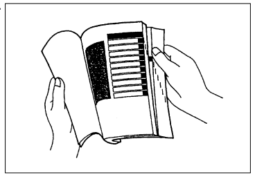

# Suzuki Bandit GSF1200/GSF1200S

# **FOREWORD**

This manual contains an introductory description on the **SUZUKI GSF1200S** and procedures for its inspection/service and overhaul of its main components.

Other information considered as generally known is not included.  
Read the **GENERAL INFORMATION** section to familiarize yourself with the motorcycle and its maintenance. Use this section as well as other sections to use as a guide for proper inspection and service.

This manual will help you know the motorcycle better so that you can assure your customers of fast and reliable service.

---

### **Notes**
- This manual has been prepared on the basis of the latest specifications at the time of publication. If modifications have been made since then, differences may exist between the content of this manual and the actual motorcycle.
- Illustrations in this manual are used to show the basic principles of operation and work procedures. They may not represent the actual motorcycle exactly in detail.
- This manual is written for persons who have enough knowledge, skills, and tools, including special tools, for servicing **SUZUKI motorcycles**. If you do not have the proper knowledge and tools, ask your authorized **SUZUKI motorcycle dealer** to help you.

---

### **⚠️ WARNING**
> Inexperienced mechanics or mechanics without the proper tools and equipment may not be able to properly perform the services described in this manual. Improper repair may result in injury to the mechanic and may render the motorcycle unsafe for the rider and passenger.

---

## **GROUP INDEX**

- [**1. GENERAL INFORMATION**](#general-information)
- [**2. PERIODIC MAINTENANCE**](#periodic-maintenance)
- [**3. ENGINE**](#engine)
- [**4. FUEL SYSTEM**](#fuel-system)
- [**5. CHASSIS**](#chassis)
- [**6. ELECTRICAL SYSTEM**](#electrical-system)
- [**7. SERVICING INFORMATION**](#servicing-information)
- [**8. GSF1200K1 (2001-MODEL)**](#gsf1200k1-2001-model)
- [**9. GSF1200K2/SK2 (’02-MODEL)**](#gsf1200k2sk2-02-model)

## **HOW TO USE THIS MANUAL**

### **TO LOCATE WHAT YOU ARE LOOKING FOR:**
1. The text of this manual is divided into sections.  
2. The section titles are listed in the **GROUP INDEX**.  
3. Holding the manual as shown at the right will allow you to find the first page of the section easily.  

4. The contents are listed on the first page of each section to help find the item and page you need.

---

## **COMPONENT PARTS AND WORK TO BE DONE**

Under the name of each system or unit, its exploded view is provided. Work instructions and other service information such as the tightening torque, lubricating points, and locking agent points are provided.

**Example: Front wheel**  

---

### **ITEMS**

| **ITEM** | **N·m** | **kgf·m** | **lb·ft** |
|----------|----------|-----------|-----------|
| **A**    | 100      | 10.0      | 72.5      |
| **B**    | 23       | 2.3       | 16.5      |

---

### **COMPONENTS**  
1. Collar  
2. Brake disc (R)  
3. Bearing (R)  
4. Spacer  
5. Bearing (L)  
6. Brake disc (L)  
7. Front wheel  
8. Air valve  
9. Balancer  
10. Axle shaft  
11. Brake disc bolt  

---

## **SYMBOL**

Listed in the table below are the symbols indicating instructions and other information necessary for servicing. The meaning of each symbol is also included in the table.

---

## **1. GENERAL INFORMATION**
<section id="general-information">

## **CONTENTS**
- [WARNING/CAUTION/NOTE](#warning-caution-note)
- [GENERAL PRECAUTIONS](#general-precautions)
- [SUZUKI GSF1200SK1 (2001-MODEL)](#suzuki-gsf1200sk1-2001-model)
- [SERIAL NUMBER LOCATION](#serial-number-location)
- [FUEL AND OIL RECOMMENDATION](#fuel-and-oil-recommendation)
  - [FUEL (For Canada)](#fuel-for-canada)
  - [FUEL (For the others)](#fuel-for-the-others)
- [ENGINE OIL](#engine-oil)
- [BRAKE FLUID](#brake-fluid)
- [FRONT FORK OIL](#front-fork-oil)
- [BREAK-IN PROCEDURES](#break-in-procedures)
- [CYLINDER IDENTIFICATION](#cylinder-identification)
- [INFORMATION LABELS](#information-labels)
- [SPECIFICATIONS](#specifications)
- [COUNTRY OR AREA CODES](#country-or-area-codes)

---

## **WARNING/CAUTION/NOTE**

### **⚠️ WARNING**
Indicates a potential hazard that could result in death or injury.

### **⚠️ CAUTION**
Indicates a potential hazard that could result in motorcycle damage.

**NOTE:**  
Indicates special information to make maintenance easier or instructions clearer.

Please note that the warnings and cautions contained in this manual cannot possibly cover all potential hazards relating to the servicing or lack of servicing of the motorcycle. In addition to the WARNINGS and CAUTIONS stated, you must use good judgment and basic mechanical safety principles. If you are unsure about how to perform a particular service operation, ask a more experienced mechanic for advice.

---

## **GENERAL PRECAUTIONS**

### **⚠️ WARNING**
- Proper service and repair procedures are important for the safety of the service mechanic and the safety and reliability of the motorcycle.
- When 2 or more persons work together, pay attention to the safety of each other.
- When it is necessary to run the engine indoors, make sure that exhaust gas is forced outdoors.
- When working with toxic or flammable materials, make sure that the area you work in is well-ventilated and that you follow all of the material manufacturer’s instructions.
- Never use gasoline as a cleaning solvent.
- To avoid getting burned, do not touch the engine, engine oil, oil cooler, and exhaust system until they have cooled.
- After servicing the fuel, oil, exhaust, or brake systems, check all lines and fittings related to the system for leaks.

### **⚠️ CAUTION**
- If parts replacement is necessary, replace the parts with Suzuki Genuine Parts or their equivalents.
- When removing parts that are to be reused, keep them arranged in an orderly manner so they may be reinstalled in the proper order and orientation.
- Be sure to use special tools when instructed.
- Make sure that all parts used in reassembly are clean. Lubricate them when specified.
- Use the specified lubricant, bond, or sealant.
- When removing the battery, disconnect the negative cable first and then the positive cable. When reconnecting the battery, connect the positive cable first and then the negative cable, and replace the terminal cover on the positive terminal.
- When performing service to electrical parts, if the service procedures do not require use of battery power, disconnect the negative cable of the battery.
- Tighten the cylinder head and case bolts and nuts in the specified tightening order and torque.
- Reuse a circlip only when installing a new circlip, ensuring it is seated securely in its groove.

---

## **SUZUKI GSF1200SK1 (2001-MODEL)**
{/*  */}

---

## **SERIAL NUMBER LOCATION**
The frame serial number or V.I.N. (Vehicle Identification Number) is stamped on the right side of the steering head pipe. The engine serial number is located on the right side of the crankcase. These numbers are required especially for registering the machine and ordering spare parts.  
{/*  */}

---

## **FUEL AND OIL RECOMMENDATION**

### **FUEL (For Canada)**
1. Use only unleaded gasoline of at least 87 pump octane (R+M)/2 or 91 octane or higher rated by the research method.
2. Suzuki recommends that customers use alcohol-free, unleaded gasoline whenever possible.

### **FUEL (For the others)**
Gasoline used should be graded 91 octane (Research Method) or higher.

---

## **ENGINE OIL**
Use a premium quality 4-stroke motor oil to ensure longer service life of your motorcycle.  
{/*  */}

---

## **BRAKE FLUID**

### **⚠️ WARNING**
Since the brake system of this motorcycle is filled with a glycol-based brake fluid by the manufacturer, do not use or mix different types of fluid such as silicone-based or petroleum-based fluid.

---

## **INFORMATION LABELS**
{/*  */}

---

## **SPECIFICATIONS**
{/*  */}

### **DIMENSIONS AND DRY MASS**

| **Specification**        | **Value**           |
|---------------------------|---------------------|
| Overall length            | 2,070 mm (81.5 in) |
| Overall width             | 765 mm (30.1 in)   |
| Overall height            | 1,220 mm (48.0 in) |
| Wheelbase                 | 1,430 mm (56.3 in) |
| Ground clearance          | 130 mm (5.1 in)    |
| Seat height               | 790 mm (31.1 in)   |
| Dry mass                  | 220 kg (485 lbs)   |

---

### **ENGINE**

| **Specification**        | **Value**                             |
|---------------------------|---------------------------------------|
| Type                      | Four-stroke, air-cooled, with SACS, DOHC, TSCC |
| Number of cylinders       | 4                                   |
| Bore                      | 79.0 mm (3.110 in)                  |
| Stroke                    | 59.0 mm (2.323 in)                  |
| Compression ratio         | 9.5:1                               |
| Piston displacement       | 1,157 cm³ (70.6 cu.in)              |
| Carburetor                | MIKUNI BSR36SS, four                |
| Air cleaner               | Non-woven fabric element            |
| Starter system            | Electric starter                    |
| Lubrication system        | Wet sump                            |

---

### **TRANSMISSION**

| **Specification**        | **Value**                             |
|---------------------------|---------------------------------------|
| Clutch                    | Wet multi-plate type                 |
| Transmission              | 5-speed constant mesh                |
| Gearshift pattern         | 1-down, 4-up                         |
| Primary reduction ratio   | 1.565 (72/46)                        |
| Final reduction ratio     | 3.000 (45/15)                        |
| Gear ratios, Low (1st)    | 2.384 (31/13)                        |
| Gear ratios, 2nd          | 1.631 (31/19)                        |
| Gear ratios, 3rd          | 1.250 (25/20)                        |
| Gear ratios, 4th          | 1.045 (23/22)                        |
| Gear ratios, Top          | 0.913 (21/23)                        |
| Drive chain               | RKGB50MF0Z1, 110 links               |

---

### **CHASSIS**

| **Specification**        | **Value**                             |
|---------------------------|---------------------------------------|
| Front suspension          | Telescopic, coil spring, oil damped, spring pre-load fully adjustable |
| Rear suspension           | Link type, oil damped, coil spring, spring pre-load 7-way adjustable, rebound damping force 4-way adjustable |
| Steering angle            | 35° (right & left)                   |
| Caster                    | 25° 20′                              |
| Trail                     | 104 mm (4.10 in)                     |
| Turning radius            | 2.8 m (9.2 ft)                       |
| Front brake               | Disc brake, twin                     |
| Rear brake                | Disc brake                           |
| Front tire size           | 120/70 ZR17 (58W), tubeless          |
| Rear tire size            | 180/55 ZR17 (73W), tubeless          |
| Front fork stroke         | 130 mm (5.1 in)                      |
| Rear wheel travel         | 125 mm (4.9 in)                      |

---

### **ELECTRICAL**

| **Specification**        | **Value**                             |
|---------------------------|---------------------------------------|
| Ignition type             | Electronic ignition (Fully Transistorized) |
| Ignition timing           | 7° B.T.D.C. at 1,500 r/min           |
| Spark plug                | NGK JR9B                             |
| Battery                   | 12 V 36.0 kC (10 Ah)/10HR            |
| Generator                 | Three-phase A.C. Generator           |
| Main fuse                 | 30 A                                 |
| Fuse                      | 15/15/15/10/10 A                     |
| Headlight                 | 12 V 55/60 W                         |
| Position light            | 12 V 5 W ... Except for E-03, -24, -28, -33 |
| Turn signal light         | 12 V 21 W × 4                        |
| Brake light/Taillight     | 12 V 21/5 W × 2                      |
| License light             | 12 V 5 W                             |
| Speedometer light         | LED                                  |
| Tachometer light          | LED                                  |
| Neutral indicator light   | LED                                  |
| High beam indicator light | LED                                  |
| Turn signal indicator light | LED                                |
| Oil pressure indicator light | LED                               |

---

### **CAPACITIES**

| **Specification**        | **Value**                             |
|---------------------------|---------------------------------------|
| Fuel tank, including reserve | 20.0 L (5.2/4.4 US/Imp gal)       |
| Engine oil, oil change    | 3.3 L (3.5/2.9 US/Imp qt)            |
| Engine oil, oil change with filter change | 3.5 L (3.7/3.1 US/Imp qt) |
| Engine oil, overhaul      | 4.6 L (4.9/4.0 US/Imp qt)            |
| Front fork oil (each leg) | 507 ml (17.2/18.0 US/Imp oz) ... E-03, -28, -33 |
|                           | 509 ml (17.2/18.0 US/Imp oz) ... Others |

---

## **COUNTRY OR AREA CODES**

| **CODE** | **COUNTRY OR AREA** |
|----------|----------------------|
| E-02     | England (UK)         |
| E-03     | USA                  |
| E-19     | European markets     |
| E-24     | Australia            |
| E-28     | Canada               |
| E-33     | California (USA)     |
| E-54     | Israel               |

</section>

---

## **2. PERIODIC MAINTENANCE**
<section id="periodic-maintenance">
Content for Periodic Maintenance goes here.
</section>

---

## **3. ENGINE**
<section id="engine">
Content for Engine goes here.
</section>

---

## **4. FUEL SYSTEM**
<section id="fuel-system">
Content for Fuel System goes here.
</section>

---

## **5. CHASSIS**
<section id="chassis">
Content for Chassis goes here.
</section>

---

## **6. ELECTRICAL SYSTEM**
<section id="electrical-system">
Content for Electrical System goes here.
</section>

---

## **7. SERVICING INFORMATION**
<section id="servicing-information">
Content for Servicing Information goes here.
</section>

---

## **8. GSF1200K1 (2001-MODEL)**
<section id="gsf1200k1-2001-model">
Content for GSF1200K1 (2001-MODEL) goes here.
</section>

---

## **9. GSF1200K2/SK2 (’02-MODEL)**
<section id="gsf1200k2sk2-02-model">
Content for GSF1200K2/SK2 (’02-MODEL) goes here.
</section>

---
---
