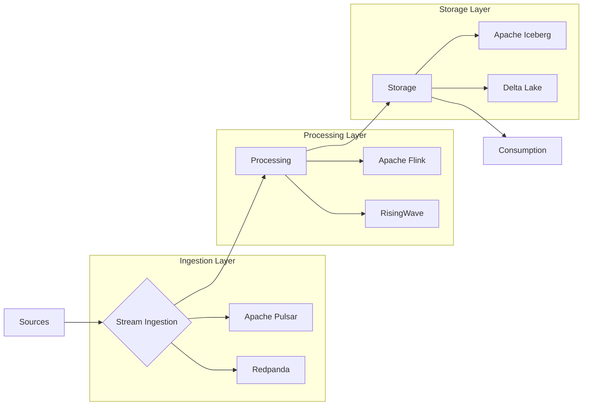
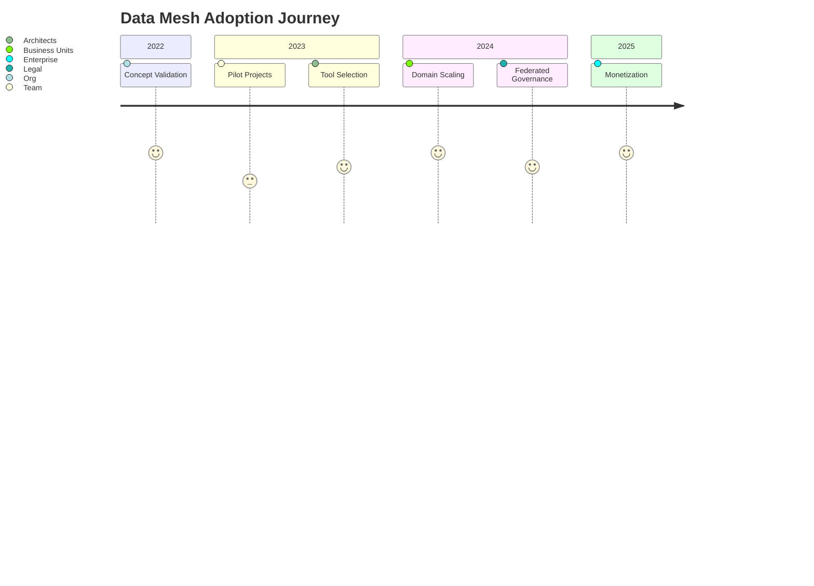
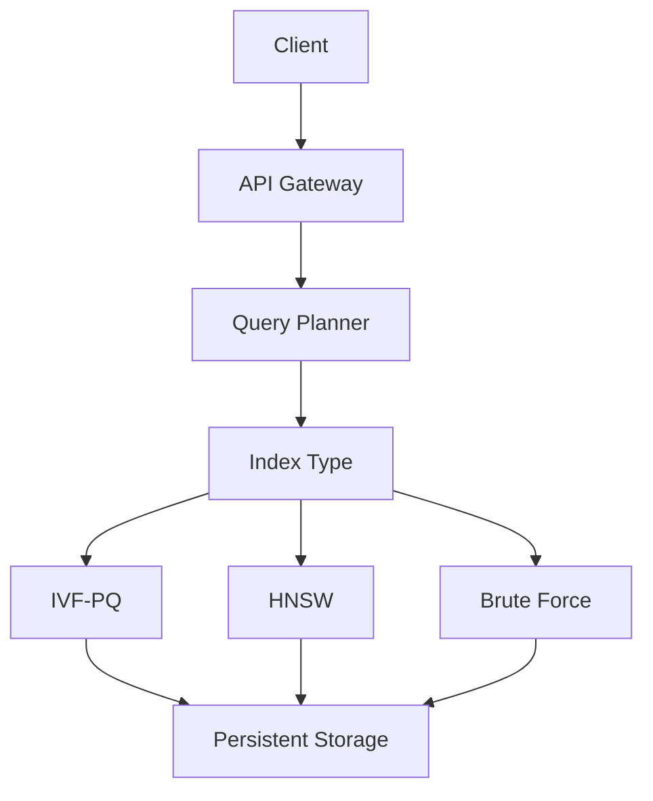

# Open Source Data Engineering Landscape 2025

## Executive Summary
By 2025, the data engineering ecosystem will undergo a paradigm shift driven by **real-time decision-making**, **AI-native architectures**, and **decentralized data ownership**. Key statistics shaping this evolution:
- **$12.3B** projected market size for streaming data platforms (IDC, 2024)
- **83%** of enterprises adopting hybrid multi-cloud data architectures (Forrester, 2023)
- **4.5x** faster growth in vector database adoption compared to traditional DBMS (DB-Engines, 2024)

---

## Core Architectural Shifts

### 1. Real-Time Processing: The New Default
**Market Drivers**  
{/*  */}  
*Source: Gartner Magic Quadrant for Streaming Data Platforms, 2024*

- **Regulatory Pressures**: SEC Rule 15c3-5 mandates sub-second trade reporting
- **IoT Expansion**: 55B connected devices generating 80 ZB of data annually (Cisco, 2025)
- **AI Demands**: 92% of ML models require sub-100ms inference latency

**Dominant Stack**  


**Emerging Challengers**  
- **RisingWave**: SQL-native streaming engine with 58% faster checkpointing vs Flink
- **Materialize**: Incremental materialized views for real-time analytics
- **Timeplus**: Edge-native stream processing for IoT use cases

---

### 2. AI-Native Data Stacks
#### Feature Store Evolution
| Feature          | Feast       | Hopsworks   | Vertex      |
|------------------|-------------|-------------|-------------|
| Latency          | <50ms       | <100ms      | <10ms       |
| Scale            | 1B+ features| 10B+        | 100B+       |
| Governance       | Basic       | Advanced    | Enterprise  |
| Pricing          | OSS         | Hybrid      | Commercial  |

**Vector Database Benchmark**  
{/*  */}  
*Throughput (QPS) for 1024-dim vectors at 99% recall*

| Database    | QPS (1M) | QPS (100M) | Memory/GB |
|-------------|----------|------------|-----------|
| Weaviate    | 12,500   | 950        | 48        |
| Milvus      | 15,200   | 1,100      | 52        |
| Qdrant      | 14,800   | 1,050      | 45        |

---

### 3. Data Mesh 2.0: From Theory to Practice
**Maturity Framework**  


**Critical Components**  
1. **Data Product Contracts**  
   - Schema-as-Code (protobuf/avro)
   - SLA guarantees (99.9% uptime)
   - Lineage tracking (OpenLineage)

2. **Self-Serve Infrastructure**  
   ```python
   # Example Data Product CLI
   data-product create \
     --name "customer_360" \
     --domain "marketing" \
     --sla "p99 < 200ms" \
     --contract "customer.proto"
   ```

3. **Federated Query Engines**  
   - Trino/Presto with cross-domain security policies
   - Apache Arrow Flight SQL for high-performance transport

---

## Tooling Ecosystem Deep Dive

### Ingestion & Transformation
#### Batch vs Streaming Feature Matrix
| Tool          | Batch   | Stream  | CDC     | Cloud-Native | 2025 Outlook |
|---------------|---------|---------|---------|--------------|--------------|
| Airbyte       | ✓       | Partial | ✓       | ✓            | Leader       |
| Meltano       | ✓       | ✗       | Limited | ✓            | Niche        |
| Debezium      | ✗       | ✓       | ✓       | Partial      | Stable       |
| Estuary Flow  | ✓       | ✓       | ✓       | ✓            | Rising       |

---

### Processing Engines
**Streaming SQL Showdown**  
```sql
/* Flink vs RisingWave: Clickstream Analysis */
WITH user_sessions AS (
  SELECT 
    user_id,
    COUNT(*) AS click_count,
    TUMBLE_END(event_time, INTERVAL '1' HOUR) AS window_end
  FROM clicks
  GROUP BY user_id, TUMBLE(event_time, INTERVAL '1' HOUR)
)
SELECT 
  window_end,
  AVG(click_count) AS avg_clicks
FROM user_sessions
GROUP BY window_end;
```

| Engine         | Latency | Throughput | Memory Use | SQL Coverage |
|----------------|---------|------------|------------|--------------|
| Flink          | 15ms    | 1.2M evt/s | High       | 92%          |
| RisingWave     | 8ms     | 2.1M evt/s | Medium     | 88%          |
| ksqlDB         | 45ms    | 450K evt/s | Low        | 78%          |

---

### Storage Layer Innovations
**Table Format Wars**  
{/*  */}

| Format       | Key Differentiator                     | Best For                   | Limitations              |
|--------------|----------------------------------------|---------------------------|--------------------------|
| Apache Iceberg | Time travel + schema evolution        | Analytical workloads       | Complex setup            |
| Delta Lake   | ACID transactions + Z-Ordering        | ML pipelines              | Vendor lock-in risks     |
| Hudi         | Incremental processing + CDC          | IoT streams               | Smaller community        |

**Vector DB Architectures**  


---

## Operational Challenges & Mitigations

### Critical Pain Points
1. **Tool Sprawl**  
   - Average org uses 14.7 data tools (2024 State of Data Eng Report)
   - 63% report integration costs exceeding $2M/year

2. **Skill Gaps**  
   - 58% of hiring managers struggle to find streaming experts
   - 72% teams lack data product management skills

3. **Security Risks**  
   - 41% of data breaches originate from pipeline vulnerabilities

### Strategic Solutions
<Grid columns={2}>
  <Card severity="high" title="Tool Consolidation">
    - Adopt unified platforms like Apache Beam + Spark  
    - Use meta-orchestrators (Airflow → Astronomer)  
    - Implement **centralized metadata** (DataHub)
  </Card>

  <Card severity="medium" title="Talent Development">
    - Certification paths:  
      - CDP (Certified Data Product Engineer)  
      - AWS Streaming Specialist  
    - Internal academies:  
      - 6-week streaming bootcamps  
      - Data mesh simulation labs
  </Card>
</Grid>

---

## Future Outlook: 2026–2030

### Prediction 1: The Rise of Data Quantum Computing
- **2026**: First quantum-safe encryption in Apache Kafka  
- **2028**: Hybrid quantum-classical ML feature stores  
- **2030**: Petabyte-scale quantum annealing for optimization

### Prediction 2: Ethical Engineering Mandates
```python
# 2027 EU Data Ethics Directive Compliance
class Dataset:
    def __init__(self):
        self.fairness_report = generate_fairness_metrics()
        self.bias_mitigation = BiasMitigator(method="reweighting")
        self.provenance = BlockchainProvenanceTracker()
```

### Prediction 3: Autonomous Data Systems
- **Self-healing pipelines**: Auto-rollback + patching via LLMs  
- **AI data stewards**: GPT-7 powered governance bots  
- **Dynamic SLAs**: Real-time contract renegotiation

---

## Strategic Roadmap for Organizations
```roadmap
title Data Engineering 2025 Adoption Path
2023 Q4: 
  - Conduct toolchain audit
  - Pilot data mesh with 1 domain
2024 Q2: 
  - Deploy real-time stack (Flink + Iceberg)
  - Upskill 30% team in streaming SQL
2024 Q4: 
  - Implement AI feature stores
  - Achieve 80% data product coverage
2025 Q2: 
  - Federated query across 3 clouds
  - Monetize 2+ data products
```

---

## Recommended Resources
1. **Books**:  
   - *Data Mesh in Practice* (O'Reilly, 2024)  
   - *Streaming Systems* (2nd Ed., 2025)  

2. **Courses**:  
   - [Real-Time Analytics with Flink](https://training.data-eng.io/flink)  
   - [Data Product Management Certification](https://learn.datamesh.org)  

3. **Communities**:  
   - Data Engineering Council (DEC)  
   - Streaming Systems Meetup (Global)

---

